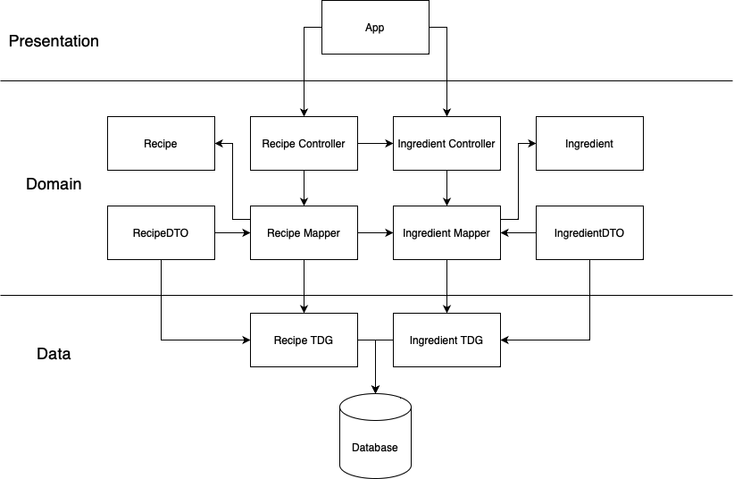

# SOEN 6441 - Project

An implementation of Data Mapper and Table Data Gateway Object Relational Model in Java.

## Project Video
https://drive.google.com/file/d/1dKIPuKNXiK61_Y82wPWpzbJX3VVsy4MX/view?usp=sharing

## The Design of the Project



## How to Run the Project

1. Open the server folder in your favorite IDE
2. Locate the **main** method inside class App
3. Build and run like any other Java Project
4. Run the following commands in command line

### RESTful Commands

**GET** Find all 
```
curl --location --request GET 'localhost:4567/ingredients' | json_pp
```
**GET** Find one
```
curl --location --request GET 'localhost:4567/ingredients/1001' | json_pp
```

**POST** Create One
```
curl --location --request POST 'localhost:4567/ingredients' \
--header 'Content-Type: application/json' \
--data-raw '{
    "name": "ingredient x",
    "amount": 25,
    "unit": "grams",
    "original": "25 grams of ingredient x"
}' | json_pp
```
PS: Please keep the id handy so that you can delete it later on.

**PUT** Update One
```
curl --location --request PUT 'localhost:4567/ingredients/1019' \
--header 'Content-Type: application/json' \
--data-raw '{
    "name": "feta cheese",
    "amount": 0.5,
    "unit": "oz",
    "original": "1/2 oz. feta cheese"
}'
```
To check that the values changed
```
curl --location --request GET 'localhost:4567/ingredients/1019' | json_pp
```

**DELETE** Delete One
```
curl --location --request DELETE 'localhost:4567/ingredients/<Please use the id of the created ingredients/or any ingredients>'
```

